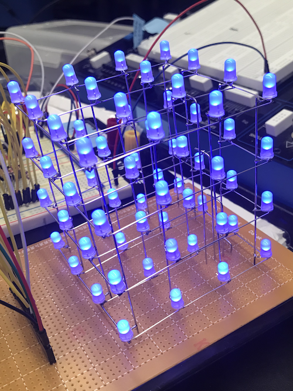

# LED Cube

For my final project in Digital Electronics, I decided to build an LED Cube from scratch as well as the driver circuit. What's different with this project, compared to all LED cube tutorials found online, is my driver circuit does not use a microprocessor or a microcontroller like an Arduino. Instead, all the animation frames are stored on a 2KB EEPROM, and the driver circuit uses the stored data to display each frame.

This repository contains the code I used to generate all the display frames, as well as a simulator to aid in designing and debugging.

The code I wrote ultimately creates a .bin file since that is what the EEPROM programmer requires. 

Created Spring 2019

# Directories

The `/original` directory contains all the code I used for my final project

The `/arduino` directory contains the code I wrote to be compiled onto an Arduino. The code was written specifically for an ATTINY84A microcontroller, but it can be programmed to an Arduino easily as well. The ATTINY84A is just a mini Arduino chip that can be placed onto a breadboard directly.

# Videos
Simulation: https://youtu.be/__pvptnB81A

LED Cube: https://youtu.be/2x6tbyymKe0