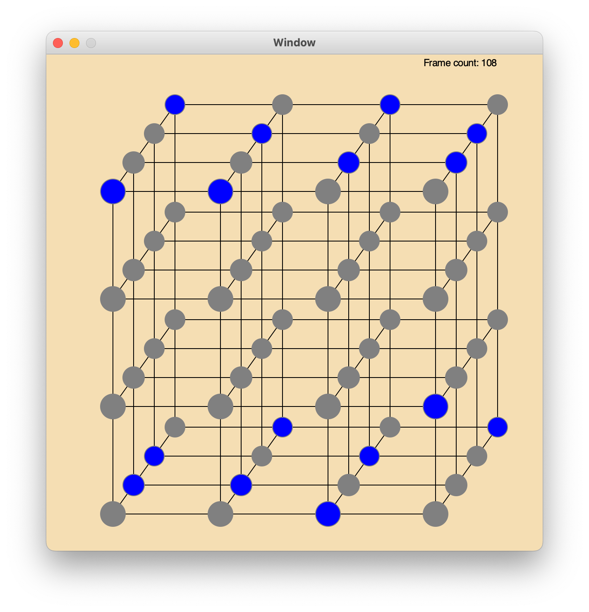

# LED Cube


For my final project in Digital Electronics, I decided to build an LED Cube from scratch as well as the driver circuit. What's different with this project, compared to all LED cube tutorials found online, is my driver circuit does not use a microprocessor or a microcontroller like an Arduino. Instead, all the animation frames are stored on a 2KB EEPROM, and the driver circuit uses the stored data to display each frame.

This repository contains the code I used to generate all the display frames, as well as a simulator to aid in designing and debugging.

The code I wrote ultimately creates a .bin file since that is what the EEPROM programmer requires. 

Created Spring 2019

# Files
The following are the main files used:

- animations.txt: Holds the main animation frames data. I wrote a basic compiler that'll allow patterns to be repeatable. Comments may be added for better organization, and sections that should be repeated can be specified.
- generate.py: Reads animations.txt and compiles to an intermediate file animations.par (short for parsed), and it then transforms the data in animations.par into the binary file animations.bin.
- pattern_maker.py: The file used to make complex animations. It generates a file called custom-patterns.txt, and the contents of this file is intended to be copied and pasted into animations.txt.
- display_cube.py: The simulation program that reads data from the binary file animations.bin and displays it on the screen.

# Instructions to run the code

To change the frame data, edit animations.txt. Each frame is 8 bytes, organized as XXXX XXXX XXXX XXXX. Overall, each hex character can be thought of as a bit field representing 4 bits, and each bit represents a single LED on the overall cube. The left-most bit for every character will always represent an LED on the left wall, and the right-most bit represents an LED on the right wall. The first 4 hex character group contains data for the top 16 LEDs layer, the second group contains data for the second layer of LEDs, and so on. The first character in each group translates to the back row of LEDs for a layer, and the last character translates the front row of LEDs. The EEPROM I used can contain at most 2048 bytes of data, so there are a total of 256 frames.

Once the data is filled out in animations.txt, run 

```python3 generate.py```

This will generate two files: animations.par and animations.bin. animations.par is primarily used for debugging to make sure all the repeated sections from animations.txt are correctly resolved, and it is untimately just a text file. animations.bin is the file that is then loaded into the EEPROM programmer.

To simulate the frames, run 

```python3 display_cube.py```

This will read the animations.bin file from the previous step. The variable `frequency` inside main() in display_cube.py can be changed to either speed up or slow down the animations.



# Videos
Simulation: https://youtube.com/shorts/DCfWbRFKAcY

LED Cube: https://youtu.be/2x6tbyymKe0